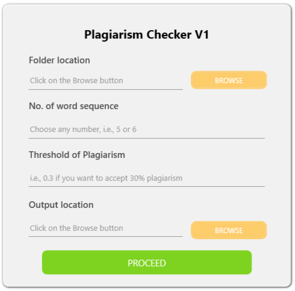

# Summary
Plagiarism, from an academic perspective, is defined as an act of presenting other people’s ideas, statements or works as their own [@anderson2011problem]. It is always a concern in universities and other academic institutions as this is quite common among students while submitting any assignments or reports. Teachers face difficulties in marking students’ assignments with a higher degree of judgment and waste their valuable time for plagiarism detection. In addition to that plagiarism has a serious effect on the learning objectives and creative thinkings of students. This software focuses on building an effective, simple and robust tool for plagiarism detection on text-based electronic assignments to minimize this issue and help teachers in conducting the proper evaluation of assignments and reports. Though text retrieval research has yielded some mature systems that are successful to detect copied or moderately altered text in an input document, those are well-suited to detect plagiarism of copy-paste type only [@weber2014false]. Researchers have proposed numerous approaches to improve the text-similarity assessment methods by adopting methods like paraphrasing, sentence matching or keyword matching [@gupta2016study]. Some commercially existing software such as have implemented those approaches and established those as an effective solution to detect plagiarism. A list of that software can be found in [@gupta2016study]. However, none of those are freely available as well as they do not fulfill the actual need of academic faculties and instructors. To fulfill the aforementioned issues, **AcPgChecker** focuses on providing an effective tool for academic faculties and instructors to detect plagiarism in text-based electronic assignments. 

# Functionality and Features
**AcPgChecker** provides some essentials and unique features for academic faculties and instructors -

* The software does not require users to upload each document separately. The user only needs to browse the folder that contains all the documents.
* It supports pdf documents so far though it can be extended to other file formats in the future.
* The output file is in excel format containing the roll numbers and percentage of similarity among the documents.
* Users can customize the number of word sequences of similarity.
* The threshold of plagiarism is also customizable depending on user needs.

# References